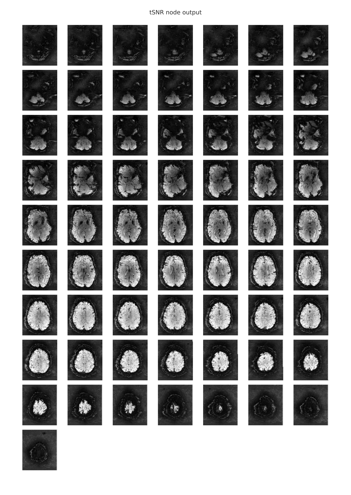

Various objective measures for MRI data quality have been proposed over the years.  However, until now no software has allowed researchers to obtain all these measures in the same place with relative ease.  The QAP package allows you to obtain spatial and anatomical data quality measures for your own data.  Since no standard thresholds demarcating acceptable from unacceptable data are currently existent, you can then compare your data to normative distributions of measures obtained from the [ABIDE](http://fcon_1000.projects.nitrc.org/indi/abide/),  [CoRR](http://fcon_1000.projects.nitrc.org/indi/CoRR/html/index.html) and [NFB](http://fcon_1000.projects.nitrc.org/indi/enhanced/) datasets.

For more information, please see our recent [resting-state poster and associated code]( http://github.com/czarrar/qap_poster).

**Table of Contents**

* [Installing the QAP Package](#installing-the-qap-package)
* [Taxonomy of QA Measures](#taxonomy-of-qa-measures)
  * [Spatial QA metrics of anatomical data](#spatial-anatomical)
  * [Spatial QA metrics of functional data](#spatial-functional)
  * [Temporal QA metrics of functional data](#temporal-functional)
* [Normative Metrics (ABIDE and CoRR)](#normative-metrics)
* [Pipeline Configuration YAML Files](#pipeline-configuration-yaml-files)
* [Subject List YAML Files](#subject-list-yaml-files)
* [Running the QAP Pipelines](#running-the-qap-pipelines)
* [Running the QAP Pipelines on AWS Cloud Instances](#running-the-qap-pipelines-on-aws-amazon-cloud-instances)
* [Merging Outputs](#merging-outputs)
* [Generating Reports](#generating-reports) 
* [References](#references)

## Installing the QAP Package

### System Requirements

* Any *nix-based operating system capable of running QAP will work, so long as it can run [AFNI](http://afni.nimh.nih.gov).
* The total amount of free hard disk space required is 5.7 GB.

### Application Dependencies

QAP requires AFNI to run. Links to installation instructions for AFNI are listed below:

* [AFNI Installation](http://afni.nimh.nih.gov/pub/dist/HOWTO/howto/ht00_inst/html)

If you are using a Debian-based Linux distribution, you can use `apt-get` by first adding Neurodebian to the apt repository list and then installing the Neurodebian AFNI package:

    wget -O- http://neuro.debian.net/lists/$(lsb_release -cs).us-nh.full | tee /etc/apt/sources.list.d/neurodebian.sources.list
    apt-key adv --recv-keys --keyserver pgp.mit.edu 2649A5A9
    apt-get update
    apt-get install -y afni

### Python Dependencies and QAP

QAP requires the following version of Nipype, available here:

* [Nipype zip](https://github.com/ccraddock/nipype/archive/master.zip)

To install the package, unzip the archive and run `python setup.py install` from within the extracted directory.

QAP also requires Numpy, Scipy, Nipype, Nibabel, Nitime, PyYAML, and Pandas to run.  If you have `pip`, you may install all of these and QAP itself by typing in the command below:

    pip install qap

If you plan on using the *write_graph* option to write out an illustration of the workflow used by QAP (see below), you will also need to install *graphviz* from [here](http://www.graphviz.org/Download..php) as well as *pygraphviz*, which can be installed by typing:

    pip install pygraphviz

## Taxonomy of QA Measures

There are three sets of measures that can be run using the QAP software package:

* Spatial anatomical measures
* Spatial functional measures, which use the mean functional image.
* Temporal functional measures, which use the functional timeseries.

The following sections will describe the measures belonging to these sets in detail.  The label used in the CSV files output by QAP is designated by brackets after the long form measure name.

To determine subjects that are outliers for any of these measures, run QAP on an array of subjects and take 1.5x or 3x the inter-quartile range.

### Spatial Anatomical

* **Signal-to-Noise Ratio (SNR) [snr]:** The mean intensity within gray matter divided by the standard deviation of the values outside the brain.  Higher values are better [^4].
* **Contrast to Noise Ratio (CNR) [cnr]:** The mean of the gray matter intensity values minus the mean of the white matter intensity values divided by the standard deviation of the values outside the brain.  Higher values are better [^4].
* **Foreground to Background Energy Ratio [fber]:** The variance of voxels inside the brain divided by the variance of voxels outside the brain.  Higher values are better. 
* **Percent Artifact Voxels (Qi1) [qi1]:** The proportion of voxels outside the brain with artifacts to the total number of voxels outside the brain.  Lower values are better [^5].
* **Smoothness of Voxels (FWHM) [fwhm, fwhm_x, fwhm_y, fwhm_z]:** The full-width half maximum (FWHM) of the spatial distribution of the image intensity values in voxel units.  Lower values are better [^3].
* **Entropy Focus Criterion (EFC) [efc]:** The Shannon entropy of voxel intensities proportional to the maximum possibly entropy for a similarly sized image. Indicates ghosting and head motion-induced blurring.  Lower values are better [^1].

### Spatial Functional

* **Ghost to Signal Ratio (GSR) [ghost_x, ghost_y or ghost_z]:** A measure of the mean signal in the areas of the image that are prone to ghosting based off the phase encoding direction.  Lower values are better. [^10]

### Temporal Functional

* **Foreground to Background Energy Ratio [fber]:** The variance of voxels inside the brain divided by the variance of voxels outside the brain.  Higher values are better. 
* **Smoothness of Voxels (FWHM) [fwhm, fwhm_x, fwhm_y, fwhm_z]:** The full-width half maximum (FWHM) of the spatial distribution of the image intensity values in voxel units.  Lower values are better [^3].
* **Entropy Focus Criterion (EFC) [efc]:** The Shannon entropy of voxel intensities proportional to the maximum possibly entropy for a similarly sized image. Indicates ghosting and head motion-induced blurring.  Lower values are better [^1].
* **Standardized DVARS [dvars]:** The average change in mean intensity between each pair of fMRI volumes in a series scaled to make comparisons across scanning protocols possible.  Lower values are better [^7]. 
* **Outlier Detection [outlier]:** The mean count of outliers found in each volume using the [3dToutcount](http://afni.nimh.nih.gov/pub/dist/doc/program_help/3dToutcount.html) command from [AFNI](http://afni.nimh.nih.gov/afni).  Lower values are better [^2]. 
* **Global Correlation [gcorr]:** The average correlation of all pairs of voxel time series inside of the brain.  Illustrates differences between data due to motion/physiological noise/imaging artifacts (such as signal bleeding).  Values closer to zero are better. [^11]
* **Median Distance Index [quality]:** The mean distance (1 – spearman’s rho) between each time point's volume and the median volume using AFNI’s [3dTqual](https://afni.nimh.nih.gov/pub/dist/doc/program_help/3dTqual.html) command.  Lower values are better [^2]. 
* **Mean RMSD [mean_fd]:** A measure of subject head motion, which compares the motion between the current and previous volumes. This is calculated by summing the absolute value of displacement changes in the x, y and z directions and rotational changes about those three axes. The rotational changes are given distance values based on the changes across the surface of a 80mm radius sphere.  Lower values are better [^9][^13]. 
* **Number of volumes with FD greater than 0.2mm [num_fd]:** Lower values are better.
* **Percent of volumes with FD greater than 0.2mm [perc_fd]:** Lower values are better.

## Normative Metrics

We have gathered QA metrics for two multi-site resting-state datasets: [ABIDE](http://fcon_1000.projects.nitrc.org/indi/abide/) (1,110+ subject across 20+ sites) and [CoRR](http://fcon_1000.projects.nitrc.org/indi/CoRR/html/index.html) (1,400+ subjects across 30+ sites). The QA metrics for these datasets have been made publicly available. They can be used for a variety of applications, for instance, as a comparison to the QA results from your own data. For each link below, please right click and select save as:

* [ABIDE - Anatomical Measures](https://raw.githubusercontent.com/preprocessed-connectomes-project/quality-assessment-protocol/master/poster_data/abide_anat.csv)
* [ABIDE - Functional Measures](https://raw.githubusercontent.com/preprocessed-connectomes-project/quality-assessment-protocol/master/poster_data/abide_func.csv)
* [CoRR - Anatomical Measures](https://raw.githubusercontent.com/preprocessed-connectomes-project/quality-assessment-protocol/master/poster_data/corr_anat.csv)
* [CoRR - Functional Measures](https://raw.githubusercontent.com/preprocessed-connectomes-project/quality-assessment-protocol/master/poster_data/corr_func.csv)
* [NFB - Anatomical Measures](https://raw.githubusercontent.com/preprocessed-connectomes-project/quality-assessment-protocol/master/normative_data/NFB_qap_anatomical_spatial.csv)
* [NFB - Functional Measures](https://raw.githubusercontent.com/preprocessed-connectomes-project/quality-assessment-protocol/master/normative_data/NFB_qap_functional_spatial_temporal.csv)

## Pipeline Configuration YAML Files

Certain pre-processed files derived from the raw data are required to calculate the measures described above. By default, the QAP software package will generate these pre-requisite files given the raw data you have (anatomical/structural scans for the anatomical measures, 4D anatomical+timeseries scans for the functional). A preprocessing pipeline will be constructed to create these files, and this pipeline can be customized with a pipeline configuration YAML file you provide.

Some examples of customizable features include segmentation thresholds for anatomical preprocessing, and the option to run slice timing correction for functional preprocessing. Computer resource allocation can also be customized using the configuration files, such as dedicating multiple cores/threads to processing.

Templates for these files are provided in the [`/configs` folder](https://github.com/preprocessed-connectomes-project/quality-assessment-protocol/tree/master/configs) in the QAP main repository directory. Below is a list of options which can be configured for each of the pipelines.

* **pipeline_name**: A label for your pipeline run.
* **num_processors**: The number of CPUs to dedicate to the entire run.
* **num_sessions_at_once**: Number of sessions to include in each bundle/workflow. When running on a cluster, this is how many sessions will be sent to each sub-node at a time.
* **available_memory**: The amount of memory (RAM) you wish to allocate for the *entire* run.
* **cluster_system**: Which cluster system you are using, if running QAP on a cluster/grid (ex. SGE, PBS, or SLURM).
* **output_directory**: The directory to write output files to.
* **working_directory**: The directory to store intermediary processing files in.
* **template_head_for_anat**: Template head to be used during anatomical registration, as a reference.
* **write_all_outputs**: A boolean option to determine whether or not all files used in the process of calculating the QAP measures will be saved to the output directory or not.  If *True*, all outputs will be saved.  If *False*, only the csv file containing the measures will be saved.
* **write_report**: A boolean option to determine whether or not to generate report plots and a group measure CSV ([see below](#generating-reports)).  If *True*, plots and a CSV will be produced; if *False*, QAP will not produce reports.
* **exclude_zeros**: (Only impacts anatomical spatial measures). Exclude zero-value voxels from the background of the anatomical scan. This is meant for images that have been manually altered (ex. ears removed for privacy considerations), where the artificial inclusion of zeros into the image would skew the QAP metric results.
* **start_idx**: (Only impacts functional temporal measures). This allows you to select an arbitrary range of volumes to include from your 4-D functional timeseries. Enter the number of the first timepoint you wish to include in the analysis. Enter *0* to include the first volume.
* **stop_idx**: (Only impacts functional temporal measures). This allows you to select an arbitrary range of volumes to include from your 4-D functional timeseries. Enter the number of the last timepoint you wish to include in the analysis. Enter *End* to include the final volume. Enter *0* in start_idx and *End* in stop_idx to include the entire timeseries.
* **ghost_direction**: (Only impacts functional spatial measures). Allows you to specify the phase encoding (*x* - RL/LR, *y* - AP/PA, *z* - SI/IS, or *all*) used to acquire the scan.  Omitting this option will default to *y*.

## Data Configuration (Participant List) YAML Files

### Providing Raw Data

The QAP pipelines take in subject list YAML (.yml) files as an input. The filepaths to your raw data are defined in these data configuration files, and these YAML files can be easily generated using the *qap_sublist_generator.py* script included in the QAP software package. After installing the QAP software package, this script can be run from any directory. Note the sublist generator also accepts links to data stored on Amazon Web Services (AWS) S3 storage buckets, with the raw data filepaths pre-pended with the "s3://" prefix.  This subject list generator script supports both the BIDS specification directory structure, and the following structure:

	/data_directory/site_name/participant_id/session_id/scan_id/file.nii.gz

Where `participant_id` is replaced with a participant ID code, `session_id` is replaced with a folder of the form `session_<number>`, and `scan_id` is replaced with `anat_<number>`, `func_<number>` or `rest_<number>` depending on the scan type. To make the script parse the above directory structure and generate the subject list YAML file, invoke the following command:

    qap_sublist_generator.py {absolute path to site_name directory} {path to where the output YAML file should be stored}

These subject lists can also be created or edited by hand if you wish, though this can be cumbersome for larger data sets. For reference, an example of the subject list format follows:

	'1019436':
	  session_1:
	    anatomical_scan:
	      anat_1: /test-data/site_1/1019436/session_1/anat_1/mprage.nii.gz
	'2014113':
	  session_1:
	    anatomical_scan:
	      anat_1: /test-data/site_1/2014113/session_1/anat_1/mprage.nii.gz
	'3154996':
	  session_1:
	    anatomical_scan:
	      anat_1: /test-data/site_1/3154996/session_1/anat_1/mprage.nii.gz

Note that *anatomical_scan* is the label for the type of resource (in this case, anatomical raw data for the anatomical spatial QAP measures), and *anat_1* is the name of the scan. There can be multiple scans, which will be combined with subject and session in the output. 

## Running the QAP Pipelines

There is one launch script for all three QAP measure sets. The Python-friendly YAML file format is used for the input subject list and pipeline configuration files. You can use these scripts from the command line, from within iPython, or with AWS Cloud instances. After installing the QAP software package, this script can be run from any directory:

* qap_measures_pipeline.py

For command-line runs:

    qap_measures_pipeline.py {path to data configuration YAML file} {path to pipeline configuration YAML file}

Executing any of the scripts with only the *-h* flag will produce a short help manual listing the command line arguments.

## Running the QAP Pipelines on AWS Amazon Cloud Instances

With access to the Amazon Cloud, the QAP measures can be calculated for a large volume of subjects quickly.

Since there is substantial overlap between the software pre-requisites of QAP and [C-PAC](http://fcp-indi.github.io/docs/user/index.html), it is recommended that you use the C-PAC AMI for your cloud instances.  The C-PAC AMI can be used as a base onto which you can [install QAP](#qap). Consult [C-PAC's cloud instructions](http://fcp-indi.github.io/docs/user/cloud.html) for more information on how to use the C-PAC AMI, as well as more general information about AWS.

If you choose to use another AMI, you will need to install both QAP and its pre-requisites from scratch by [following the instructions above](#installing-the-qap-package).  You will also need to configure Starcluster to use the `mnt_config` and `cpac_sge` plugins by following the instructions [here](http://fcp-indi.github.io/docs/user/cloud.html#installing-the-c-pac-starcluster-plug-ins).

## Merging Outputs

QAP generates outputs for each participant and session separately.  To view a comprehensive summary for all the measures for all the subjects, you will need to merge these separate outputs into a single file.  You can do this by running the following command:

    qap_jsons_to_csv.py {path to qap output directory}

This script will automatically determine if you have calculated anatomical spatial, functional spatial or functional temporal measures.  The merged outputs will appear in a file named `qap_anatomical_spatial_{qap output directory name}.csv` in the directory from which the command is run.

## Generating Reports

The report functions in the Quality Assessment Protocol allow you to generate optional reports which plot the measures for individual scans, as well as the for the entire group of scans or individuals. These reports aid the visual inspection of scan quality and can be generated by using the [typical workflow commands](#running-the-qap-pipelines).

In the case of the functional-spatial workflow, instead of just generating separate CSV files that contain each functional scan's spatial QC metrics, the `qap_functional_spatial.py` script will also automatically generate a CSV file that contains the group-level metrics for all scans that were included as inputs. These group-level summary metrics will appear in a file named `qap_functional_spatial.csv` in the output directory designated in the config file.

In addition, you have the option of generating group-level reports with plots of all the various metrics that contain scores aggregated from all scans/individuals per metric. If this option is selected, there will also be a `qap_functional_spatial.pdf` file which will contain all of the group-level violin plots for each metric. The workflow will also generate report pdfs for each scan (e.g., `qap_functional_spatial_sub-01.pdf`). However, in this case, these reports will also contain any relevant slice mosaics. It is important to note that the individual-level violin plots are the same as those in the group reports, except for the addition of a star, or stars, that represents the score(s) for the scan from that session. The star in these plots denotes where the score for the scan for this individual falls in the distribution of all scores for scans that were included as inputs to the the functional-spatial workflow. If there are several scans per session for this individual, then the stars will be displayed adjacent to each other in the violin plot.

### Report Examples

The following image is an example of a report which contains the QC metrics generated by the functional spatial workflow. The group-level data are depicted as violin plots, with each of the plots being a representation of the corresponding values from the column with the same name in the group-level CSV file. In this example, the star denotes where the score for this particular scan falls in the distribution for that metric. The actual value for this scan can be found in the appropriate column of the individual-level CSV file.

The following image is an example of the rendering of the mean EPI image which is provided in the individual-level functional-spatial report. This mean EPI was created by averaging the signal intensity values in each voxel over time. Hence, a 3-dimensional image was created from the 4-dimensional scan and was displayed as a slice mosaic. This image can be used to eyeball the overall quality of the scan, as it will be obvious if there were any large gaps in the image that might indicate that this scan is unusable.

The following image is an example of the rendering of the temporal signal-to-noise ratio information from a functional scan, which is provided in the individual-level functional-temporal report. The tSNR plot is similar to the mean EPI plot, in that both metrics reduce the 4-dimensional scan to a representative 3-dimensional volume that is then split and displayed as a stack of axial (horizontal) slices. In this case of the timeseries signal-to-noise ratio, the mean of each voxel's timeseries is also computed and is then divided by the timeseries standard deviation. Hence, the tSNR plot shows the voxels in which one would expect to have SNR good enough for statistical analyses. Differences in tSNR are particularly important for comparing the results from region of interest (ROI) analyses, since any observed functional differences might actually be attributable to systematic differences in SNR across the regions being compared. [You can learn more about the utility of tSNR plots for fMRI analyses here.](http://practicalfmri.blogspot.com.es/2011/01/comparing-fmri-protocols.html)

The following image is an example of the framewise displacement that occurred throughout the scan, which is also provided in the individual-level functional-temporal report. This is a temporal motion quality assurance metric and tracks head motions over time, making it easy to determine whether or not the data potentially suffered from significant corruption due to motion. For instance, it is possible to detect if the participant's head was slowly sinking into the cushions in the head coil, or whether the participant was possibly restless or agitated, which would result in several position changes or movement spikes. The framewise displacement is a frame-by-frame representation of the differences between the BOLD signal intensity values of the n and n+1 time points, the n+1 and n+2 timepoints, and so on. The report page for framewise displacement in the functional scan includes both a frame-by-frame plot, as well as a histogram that can be used to visually determine what proportion of timepoints exceeded some pre-set movement threshold (e.g., 0.2 mm).

Below is an example of the slice mosaic that is provided as a part of the anatomical-spatial workflow. This image is a rendering of the axial slices from the anatomical scan and it is provided in the individual-level report. This slice mosaic can be used to eyeball the quality of the overall signal in the anatomical scan. It should be evident from visual inspection whether there were any problem areas where the signal distortion and/or dropout was large enough to warrant the exclusion of this anatomical can from subsequent analyses.

### Downloading Data from Your S3 Bucket

If you ran QAP to push the output JSON files to S3 storage on the cloud, you will need to download the outputs from S3 before you can merge them.  To do this, run the following command:

    qap_download_output_from_S3.py {path to the S3 directory containing subject outputs} {path to AWS key file} {s3 bucket name} {type of measure to download} {directory to download to}

For example, if you wanted to obtain functional spatial measures from an S3 bucket named `the_big_run` with subject outputs in `subjects/outputs` you would use the following command.

    qap_download_output_from_S3.py subjects/outputs /home/wintermute/Documents/aws-keys.csv the_big_run func_spatial /home/wintermute/qap_outputs

With the above commands, the outputs will be stored in a directory named `qap_outputs` in the user *wintermute*'s home folder.  As with the pipeline commands from earlier, more information on this command's usage can be obtained by running it with the *-h* flag.  

## References

[^1]: Atkinson D, Hill DL, Stoyle PN, Summers PE, Keevil SF (1997). Automatic correction of motion artifacts in magnetic resonance images using an entropy focus criterion. IEEE Trans Med Imaging. 16(6):903-10.

[^2]: Cox, R.W. (1996) AFNI: Software for analysis and visualization of functional magnetic resonance neuroimages. Computers and Biomedical Research, 29:162-173.

[^3]: Friedman, L., Glover, G.H., Krenz, D., Magnotta, V., First, B., 2006. Reducing Inter-Scanner Variability of Activation in a Multicenter Fmri Study: Role of Smoothness Equalization. Neuroimage 32, 1656-1668. 

[^4]: Magnotta, V. A., & Friedman, L. (2006). Measurement of signal-to-noise and contrast-to-noise in the fBIRN multicenter imaging study. Journal of Digital Imaging, 19(2), 140-147.

[^5]: Mortamet, B., Bernstein, M. A., Jack, C. R., Gunter, J. L., Ward, C., Britson, P. J., Meuli, R., Thiran, J.P. & Krueger, G. (2009). Automatic quality assessment in structural brain magnetic resonance imaging. Magnetic Resonance in Medicine, 62(2), 365-372.

[^7]: Nichols, T. (2012, Oct 28). Standardizing DVARS. Retrieved from http://blogs.warwick.ac.uk/nichols/entry/standardizing_dvars.

[^8]: Power, J. D., Barnes, K. A., Snyder, A. Z., Schlaggar, B. L. & Petersen, S. E. (2012) Spurious but systematic correlations in functional connectivity MRI networks arise from subject motion. Neuroimage 59, 2142-2154.

[^9]: Jenkinson, M., Bannister, P., Brady, M., & Smith, S. (2002). Improved optimization for the robust and accurate linear registration and motion correction of brain images. Neuroimage, 17(2), 825-841.

[^10]: Giannelli, M., Diciotti, S., Tessa, C., & Mascalchi, M. (2010). Characterization of Nyquist ghost in EPI-fMRI acquisition sequences implemented on two clinical 1.5 T MR scanner systems: effect of readout bandwidth and echo spacing. Journal of Applied Clinical Medical Physics, 11(4).

[^11]: Saad, Z.S., Reynolds, R.C., Jo, H.J., Gotts, S.J., Chen, G., Martin, A., Cox, R.W., (2013). Correcting Brain-Wide Correlation Differences in Resting-State Fmri. Brain Connect 3, 339-352. 

[^12]: Shehzad, Z., Giavasis, S., Li, Q., Benhajali, Y., Yan, C., Yang, Z., Milham, M., Bellec, P., Craddock, R.C., 2015. The Preprocessed Connectomes Project Quality Assessment Protocol - a Resource for Measuring the Quality of Mri Data. Front. Neurosci. 9. 

[^13]: Yan CG, Cheung B, Kelly C, Colcombe S, Craddock RC, Di Martino A, Li Q, Zuo XN, Castellanos FX, Milham MP (2013). A comprehensive assessment of regional variation in the impact of head micromovements on functional connectomics. Neuroimage. 76:183-201.

